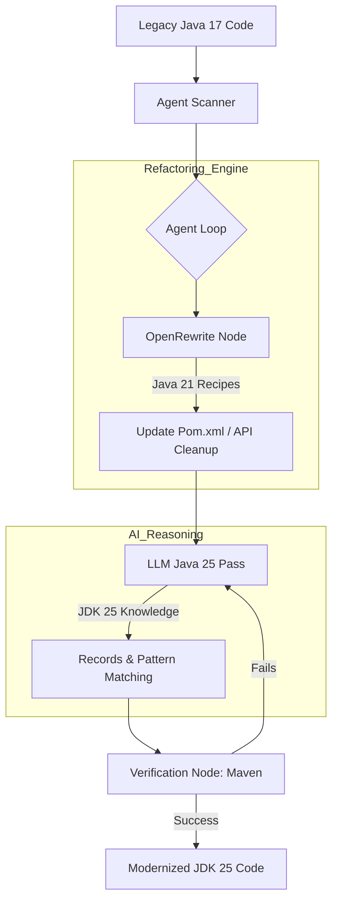

# 🚀 JDK Modernizer Agent
**AI-powered autonomous migration from Legacy Java 17 to JDK 25.**

JDK Modernizer is a stateful AI agent that migrates legacy Java codebases using a "Refactor-Verify-Correct" loop. It bridges the gap between technical debt and modern performance by combining the deterministic precision of **OpenRewrite** with the creative reasoning of **Llama 3.3 (via Groq)**.

---

## 🚀 Problem Statement
Legacy Enterprise Java migrations are often stalled due to lack of time, effort, and priority. Manual refactoring is:
1. **Error-Prone**: Developers often miss deprecated API edge cases or complex switch exhaustiveness.
2. **Scale-Limited**: Large monorepos require consistent application of recipes across thousands of files.
3. **Performance-Blind**: Legacy concurrency models (Fixed Thread Pools) aren't automatically converted to Virtual Threads, leaving performance gains on the table.

## 🛠 Approach
We utilize a **Hybrid Intelligence** model:
* **Deterministic Logic (OpenRewrite)**: Handles bulk, safe transformations using Lossless Semantic Trees (LST) to ensure 100% syntactic integrity for standard migrations (up to Java 21).
* **Probabilistic Logic (LLM)**: Orchestrates the migration to **JDK 25**, identifies complex refactoring targets (like converting POJOs to Records), and self-corrects compilation errors.
* **Stateful Orchestration (LangGraph)**: Manages the migration lifecycle, allowing the agent to "backtrack" or retry if a specific refactor breaks the build.

---

## 🏗 Architecture Diagram

📦 Components

    LangGraph Orchestrator: A cyclic graph that manages the state of the migration (Current File, Error Logs, Attempt Count).

    OpenRewrite Worker: Executes standard JEP (Java Enhancement Proposal) recipes (e.g., UpgradeToJava25).

    Maven Validator: A specialized node that triggers ./mvnw compile and parses the output to feed errors back to the LLM.

    CopilotKit UI: A side-by-side Diff View that lets users review and approve AI-proposed changes before they are committed to disk.

🔄 OpenRewrite Integration

The project leverages the rewrite-migrate-java artifact. We programmatically trigger recipes like:

    org.openrewrite.java.migrate.UpgradeToJava25

    org.openrewrite.java.migrate.net.MigrateURLConstructorToURI (handling JDK 20+ deprecations)

🧠 LLM & Inference Strategy
The agent currently utilizes **Groq Cloud** for high-speed, low-latency inference. 

* **Primary Model:** `llama-3.3-70b-versatile` (via Groq API).
* **Reasoning:** Chosen for its superior performance in Java code generation and zero-cost free tier for developers.
* **TODO:** - [ ] Add `ChatOllama` support to allow local execution using `DeepSeek-Coder-V2`.

🏗 Build (Maven)

The agent interacts directly with the Maven lifecycle.

    Phase 1: Update <java.version> and compiler plugins in the pom.xml.

    Phase 2: Execute a "Dry Run" of OpenRewrite.

    Phase 3: Iterative compilation. If the build fails, the agent isolates the error and re-attempts the refactor on the specific file.